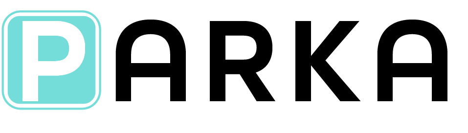

# SXU-Software-Engineering
 Dev Team 2
 - Amr Alshatnawi
 - Alejandra Lopez
 - Daniel Carabez
 - Karlee Barr
 
Project PARKA is a project that we are working on for our software engineering class at Saint Xavier University. We are developing a software product that detects the number of empty and occupied spots in a parking lot. We’re using a Raspberry Pi to run our code which is developed in Python and we’re also building a physical model (landscape) to demonstrate how the product works. A prototype of a mobile application is being developed; this app will allow users to use the software product.

